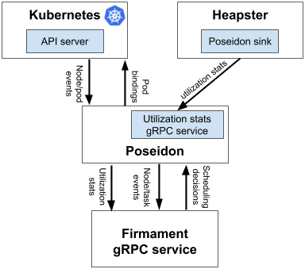

# Introduction
The Poseidon/Firmament scheduler incubation project is to bring integration of Firmament Scheduler [OSDI paper](https://www.usenix.org/conference/osdi16/technical-sessions/presentation/gog) in Kubernetes.
At a very high level, Poseidon/Firmament scheduler augments the 
current Kubernetes scheduling capabilities by incorporating a new 
novel flow network graph based scheduling capabilities alongside the default Kubernetes Scheduler. 
Firmament models workloads on a cluster as flow networks and runs min-cost flow optimizations over these networks to make scheduling decisions.

Due to the inherent rescheduling capabilities, the new scheduler enables a globally optimal scheduling for a given policy that keeps on refining the dynamic placements of the workload.

As we all know that as part of the Kubernetes multiple schedulers support, each new pod is typically scheduled by the default scheduler, but Kubernetes can be instructed to use another scheduler by specifying the name of another custom scheduler (Poseidon in our case) at the time of pod deployment. In this case, the default scheduler will ignore that Pod and allow Poseidon scheduler to schedule the Pod on a relevant node. We plugin Poseidon as an add-on scheduler to K8s, by using the 'schedulerName' as Poseidon in the pod template this will by-pass the default-scheduler. We plugin Poseidon as an add-on scheduler to K8s, by using the 'schedulerName' as Poseidon in the pod template this will by-pass the default-scheduler.

# Key Advantages

* Flow graph scheduling provides the following 
  * Support for high-volume workloads placement.
  * Complex rule constraints. 
  * Globally optimal scheduling for a given policy.
  * Extremely high scalability. 
  
  **NOTE:** Additionally, it is also very important to highlight that Firmament scales much better than default scheduler as the number of nodes increase in a cluster.

# Design 

   

   

 <b>Poseidon/Firmament Integration architecture</b> 

For more details about the design of this project see the [design document](https://docs.google.com/document/d/1VNoaw1GoRK-yop_Oqzn7wZhxMxvN3pdNjuaICjXLarA/edit?usp=sharing) doc.

# Installation
  In-cluster installation of Poseidon, please start [here](https://github.com/kubernetes-sigs/poseidon/blob/master/docs/install/README.md).
  
  
  
# Development
  For developers please refer [here](https://github.com/kubernetes-sigs/poseidon/blob/master/docs/devel/README.md)

# Roadmap
  * Upstream Heapster sink for Poseidon (Completion Date: 30th March 2018)
  * E2E                                  (Completion Date: 30th April 2018)
  * Node level Affinity and Anti-Affinity implementation (Completion Date: 30th April 2018)
  * Pod level Affinity and Anti-Affinity implementation 
    * Multi-round scheduling based affinity and anti-affinity (Completion Date: 15th April 2018)
    * XOR optimization for pod-to-pod anti-affinity (Completion Date: 15th May 2018)
    * Implement a generalized min-cost flow algorithm for pod-to-pod affinity (Completion Date: 15th June 2018)
  * Documentation improvements
  * Continuous running scheduling loop versus scheduling intervals mechanism (Completion Date: 30th April 2018)
  * Provide High Availability/Failover for in-memory Firmament/Poseidon processes
  * Resource Utilization benchmark
  * Pre-emption support
  
  
