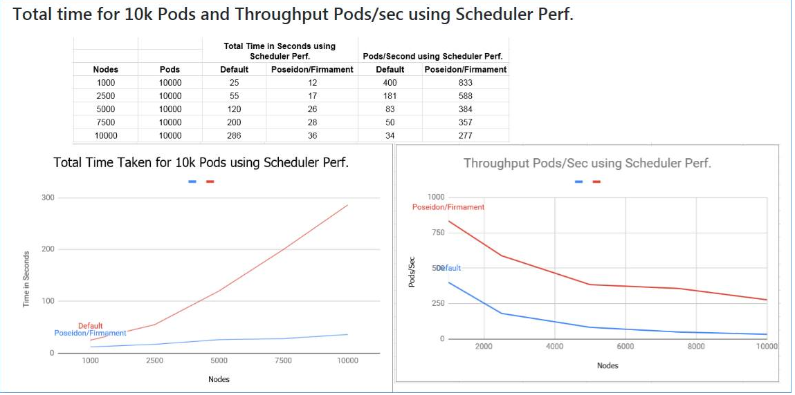
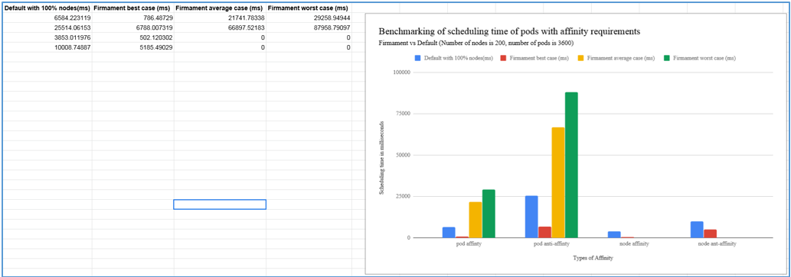
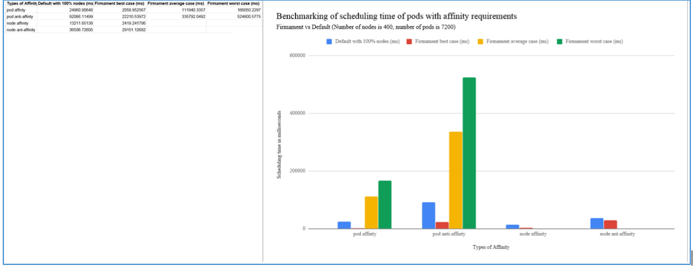
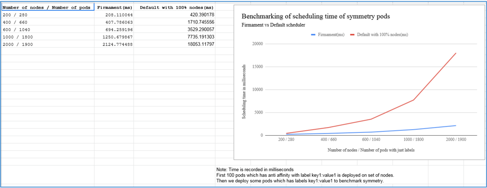

## Latest Benchmarking Results

### Scheduling time of Pods with CPU/Mem requirements only (without bind time)  

  

### Scheduling time of Pods with CPU/Mem requirements only (including bind time)  
  

### Total time for 10k Pods and Throughput Pods/sec using Scheduler Perf
  

### Scheduling time of Pods with Affinity requirements   
  

### Scheduling time of Pods with Affinity requirements   
 

### Scheduling time of Symmetry Pods   
 

