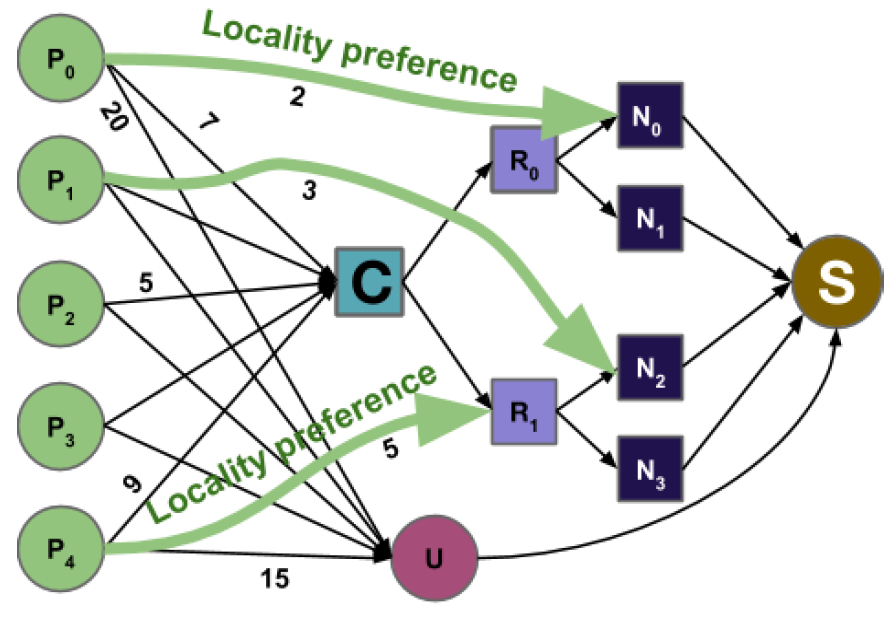
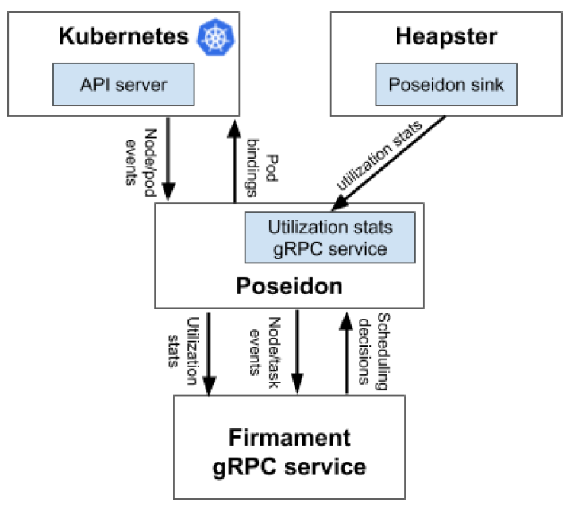
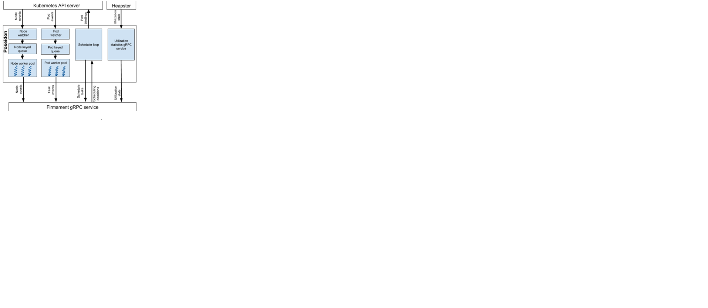
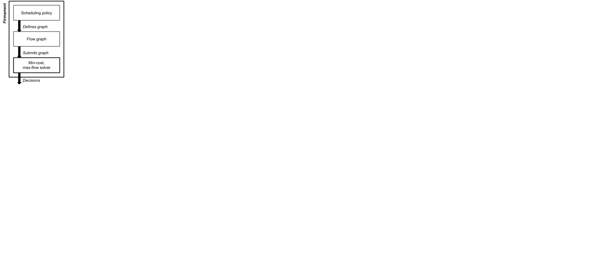
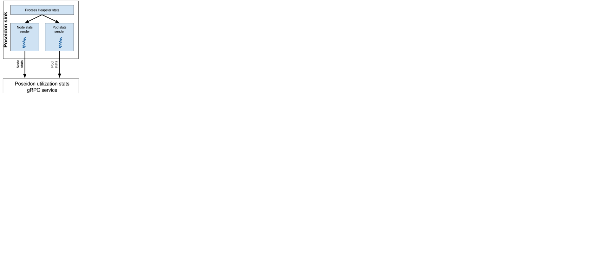

# Poseidon design document 

 Firmament Kubernetes plugin scheduler

 By Huawei Cloud PaaS Platform Team in collaboration with Ionel Gog (firmament.io) 

- [Overview](#Overview)
    - [Pod-by-pod scheduling](#pod-by-pod-scheduling)
    - [Batching scheduling](#batching-scheduling)
- [Firmament overview](#firmament-overview)
- [Poseidon design](#poseidon-design)
    - [Firmament gRPC service](#Firmament-grpc-service)
    - [Poseidon Heapster sink design](#poseidon-heapster-sink-design)
    - [Poseidon/Firmament fault tolerance](#poseidonfirmament-fault-tolerance)

**Important Note:** We would like to highlight one very important piece of information related to “Heapster” in this design 
document. Collection of real time resource utilization stats using Heapster is no longer supported any more as Heapster 
has been deprecated. Initially, we had this functionality available in order to provide support for real-time resource 
utilization based scheduling within Poseidon/Firmament. We are planning to switch to “metrics-server” in the future, 
which works conceptually similar to how Heapster works. In the meanwhile, we are leaving Heapster related information 
in the design document in order to conceptually demonstrate how real-time resource utilization based Poseidon/Firmament 
scheduling works. Currently, in the absence of real-time metrics information, Poseidon/Firmament scheduler relies on 
static resource reservation information defined as part of Pod specifications

# Overview
Poseidon is the Firmament scheduler integration for Kubernetes. Firmament models workloads and clusters as flow networks and runs min-cost flow optimizations over these networks to make scheduling decisions. In this document, we describe how Firmament’s flow-based scheduling works and how it differs from pod-by-pod schedulers, highlight the advantages it offers over the default Kubernetes scheduler, and discuss the architecture of Poseidon, our Kubernetes integration.
## Pod-by-pod scheduling
Pod-by-pod schedulers (e.g., Kubernetes scheduler) process one pod at a time. These schedulers have the advantage of being suitable for parallelization, but also have three crucial drawbacks:
1.	The scheduler commits to a pod placement early and restricts the choices for other pods that wait to be placed.
2.	There is limited opportunities for amortizing work across pods because they are considered for placement individually.
3.	Rescheduling requires external scheduling logic to decide which pods need to be rescheduled.

## Batching scheduling
The first two downsides of pod-by-pod schedulers can be addressed by batching. Processing several pods in a batch allows the scheduler to jointly consider their placement, and thus to find the best trade-off for the whole batch. An extension of this idea is to reconsider all the pods, and to preempt and migrate pods if required to meet the scheduler’s goals. This approach addresses pod-by-pod schedulers’ third drawback and unlocks advantages that can arise from rescheduling (e.g., improved application-level performance, avoidance of resource hogging by low priority tasks).

Firmament is a flow-based scheduler, that uses an efficient batching technique that runs a min-cost flow optimization in order to choose pod placements. This optimization finds optimal pod placements for Firmament’s given scheduling policy.

# Firmament overview
Firmament is a flow-based scheduler that models the workload (running and submitted pods) and the cluster (e.g, nodes, racks) as a flow network. Firmament modifies this flow network according to its scheduling policy in response to events (e.g., task submission, task completion, node failure) and monitoring information (e.g., resource utilization). Following, Firmament runs a min-cost flow algorithm over the flow network to find an optimal flow, from which it extracts the implied pod placements.

A flow network is a directed graph whose arcs carry flow from source nodes (i.e., pod nodes) to a sink node. A cost and capacity associated with each arc constrain the flow, and specify preferential routes for it. Figure 1 shows an example of a flow network for a cluster with five pods and four nodes. Each pod node Pi on the left hand side, is a source of one unit of flow. All such flow must be drained into the sink node (S) for a feasible solution to the optimization problem.
 
   

   

 <b>Figure 1:</b> Example of a flow network for a four-node cluster with five pods. Pod P0 has a preference for running on node N0, pod P1 has a preference for running on node N2, and pod P4 has a preference for running on any node from rack R1. The remaining pods (P2 and P3) do not have preferences and are connected to C, a node denoting the cluster.

To reach S, flow from Pi can proceed through a machine node (Nj), which schedules the pod 
Pi on node Nj. Alternatively, the flow may proceed to the sink through an unscheduled aggregator 
node (U), which leaves the pod unscheduled or preempts it if running. In the example, a pod’s placement preferences are 
expressed as costs on direct arcs to machines. The cost to leave the task unscheduled, or to preempt it when running, 
is the cost on its arc to the unscheduled aggregator. Given this flow network, a min-cost flow solver finds a globally 
optimal (i.e., minimum-cost) flow. This optimal flow expresses the best trade-off between the pods’ unscheduled costs 
and their placement preferences.

In Figure 1, pods had only direct arcs to nodes (Ni), racks (Rj), the unscheduled aggregator node (U), or the node 
representing the cluster C. However, the scheduling policy can define aggregator nodes, similar to the rack aggregator
nodes (Rj), that for example, can group pods with similar resource needs or machines with similar capabilities.

Firmament offers a policy API to configure the scheduling policy, which may incorporate e.g., task co-location 
interference, fairness, priority preemption. 

Firmament currently supports several scheduling policies: 

(i) a data locality policy that trade-offs pod data locality versus pod preemption costs and pod scheduling wait time

(ii) a policy that avoids pod co-location interference

(iii) a network-aware policy that avoids overloading nodes’ network connections

(iv) a simple load-spreading policy based on the number of running pods. See the [OSDI paper](https://www.usenix.org/system/files/conference/osdi16/osdi16-gog.pdf) for more details.

We decided to bring Firmament to Kubernetes because it offers several advantages over the default Kubernetes scheduler:
1.  Tremendous throughput performance benefits due to efficient amortization of work across Replicasets/Deplyments/Jobs.
2.	It makes globally optimal scheduling decisions for its policies because it uses a min-cost flow optimization that 
    finds the pod placements with the minimum overall cost.
3.	Firmament supports task re-scheduling. In each scheduler run it considers all pods, including running pods, and as 
    a result can migrate or evict pods.
4.	Firmament uses cluster utilization statistics when placing pods rather than reservations.
5.	Firmament supports several scheduling policies (e.g., network-aware, pod interference aware, load spreading) and 
    provides a simple interface for implementing new policies. 

# Poseidon design
The Firmament scheduler is open source and available at https://github.com/camsas/firmament. The following three issues must be addressed in order to be able to deploy Firmament in Kubernetes clusters:
1.	Kubernetes provides a rich API consisting of jobs, replica sets, deployments, whereas Firmament’s API consists of tasks that are grouped into jobs. Code that bridges between Kubernetes’ and Firmament’s API is required.
2.	Firmament is implemented in C++. Therefore, a Kubernetes C++ client is required or code that uses the Go client and that communicates to Firmament is required.
3.	Firmament requires utilization statistics of the Kubernetes cluster when placing pods.

   

   

 <b>Figure 2:</b> Firmament Kubernetes integration overview.

 

We developed [Poseidon](https://github.com/kubernetes-sigs/poseidon) to address the above-mentioned issues. 
Poseidon is implemented in Go and acts as a bridge between the Kubernetes cluster and Firmament. In Figure 2, we show 
an overview of Firmament’s Kubernetes integration and where Poseidon fits. Poseidon watches for updates from the 
Kubernetes cluster, transforms pods information to Firmament compatible concepts (i.e., tasks & jobs), receives 
scheduling decisions and informs the Kubernetes server API of pod bindings. Moreover, Poseidon provides a gRPC service 
which receives utilization statistics from Heapster. These statistics are transformed from per pod to per task stats 
and forwarded to the Firmament scheduler which stores the last N samples (N can be configured with a flag).

In Figure 3, we show in detail Poseidon’s design. Poseidon has two threads (i.e., node watcher and pod watcher) that 
receive updates from the Kubernetes cluster. These watchers queue updates into a bespoke keyed work queue. The keyed 
work queue groups together all the updates that have the same key (i.e., updates to pods are grouped by unique pod 
identifiers, updates to nodes are grouped by unique node identifiers). The node and pod work queues are processed by 
two worker pools: node and pod worker pools. These pools transform the updates to Firmament specific information and 
communicate with the Firmament scheduler gRPC service. The service expects to be informed by task and node state 
transition events (e.g., task submission, task completion, node failure). See [Firmament gRPC service](https://github.com/camsas/firmament/blob/master/src/scheduling/firmament_scheduler.proto) for more details.

   

   

 <b>Figure 3:</b> Poseidon design overview.

  

	
Firmament does not schedule a task at a time, but rather considers the entire workload in a each scheduler run. The 
Firmament scheduler runs continuously, and thus consider in each scheduling round all the cluster changes (e.g., 
task submissions, completions) that happened during the prior scheduler run. Thus, Poseidon has a scheduler loop that 
starts a Firmament scheduling round upon previous round’s completion.

Finally, Poseidon provides a simple gRPC service which receives utilization statistics from a Heapster Poseidon sink we 
implemented (see [Section 3.2](#poseidon-heapster-sink-design).). We do not send statistics directly from Heapster to Firmament because we would have to 
map these statistics from Kubernetes concepts (e.g., pods) to Firmament concepts (e.g., tasks) on the Firmament side. 
We want to keep the Firmament gRPC scheduler service agnostic of any cluster manager specific concepts. Thus, our 
Poseidon statistics gRPC service is responsible for doing this mapping.

## Firmament gRPC service
The [Firmament scheduler gRPC service](https://github.com/camsas/firmament/blob/master/src/scheduling/firmament_scheduler.proto) is a cluster agnostic scheduling service. It receives task and node events 
(e.g., task submission, node failures), and utilization statistics. In Figure 4, we show the steps Firmament transitions
through. Using the information it receives, Firmament defines a flow graph that models the cluster state and the workloads. 
This flow graph is submitted to min-cost flow solver which computes the optimal flow. Out of this flow, Firmament 
extracts the task placements with the overall minimum cost for its scheduling policy.
 
   

   

 <b>Figure 4:</b> Firmament scheduler overview.

  
 

Our Firmament integration currently supports scheduling policies:
1.	A load-spreading policy that places tasks on the machines that have the least amount of tasks running.
2.	A network-aware policy that avoids overloading machines’ network connections. It takes into account tasks resource 
requests and real network utilization when placing tasks. 
See [Section 3.3](https://www.usenix.org/system/files/conference/osdi16/osdi16-gog.pdf) of the Firmament paper.

In the future, we will support additional policies:
1.	The Quincy scheduling policy that trade-offs task data/memory locality, with task unscheduled wait time and task 
preemption/migration costs. See the [Quincy paper](https://www.sigops.org/sosp/sosp09/papers/isard-sosp09.pdf) and 
[Section 3.3](https://www.cl.cam.ac.uk/~icg27/pub/papers/2016-osdi-firmament.pdf) of the Firmament paper for 
descriptions of this policy.
2.	A scheduling policy that addresses co-location interference and machine heterogeneity. 
See [Section 7.3](https://people.csail.mit.edu/malte/pub/dissertations/phd-final.pdf) of Malte Schwarzkopf’s PhD thesis for a detailed description of this policy.

## Poseidon Heapster sink design
Many of Firmament’s scheduling policies use real cluster utilization information when making decisions. In our Kubernetes integration, we use Heapster to get statistics information in Poseidon, and ultimately in Firmament. In Figure 5, we show the design of our Poseidon Heapster sink.

   

   

 <b>Figure 5:</b> Poseidon Heapster sink design.

  

The sink creates a thread that processes Heapster utilization statistics. The thread sends the stats to one of the two running sender threads (i.e., node stats sender and pod stats sender). These sender threads maintain streaming connections to the Poseidon utilization stats gRPC service and forward the data they receive.

## Poseidon/Firmament fault tolerance
The current Firmament and Poseidon versions are not fault tolerant because each runs as a single replica. Upon the failure of either service, the other must be restarted for the state of both services to be correctly synchronized.

However, we plan to address this limitation in both services. In Poseidon we are considering two approaches:
1.	Simultaneously run several replicas with one designated as a leader. The leader communicates with the Firmament service and binds the Kubernetes pods to nodes. All other replicas watch the cluster state, and store mappings between Kubernetes pods and Firmament task ids, and between Kubernetes nodes and Firmament resource ids. Upon the leader’s failure, Poseidon would conduct leader election and one of the other replicas will replace the leader.
2.	Run a single Poseidon replica, but upon a failure reconstruct the pods to tasks mappings and nodes to resource mappings by querying the Kubernetes API server. We can reconstruct the state because Firmament task ids and resource ids are hashes of Kubernetes pods and nodes.

We are also considering two approaches for adding high availability support in Firmament:
1.	Run several replicas and perform leader election upon the leader's failure.
2.	Run a single Firmament replica, but upon a failure reconstruct the state by querying Poseidon. Poseidon will have information about all the pods/Firmament tasks present in the cluster and about all the nodes/Firmament resources that the cluster comprises of. In this approach, we would also have to recover the resource statistics uses when making its scheduling decisions. The absence of several statistics is unlikely to significantly affect scheduling decisions, and thus it is not a problem if the latest statistics before failure have not been replicated/persisted. Thus, we could store these statistics in a replicated key value store, but we would not have to wait for the latest statistics to be replicated.
