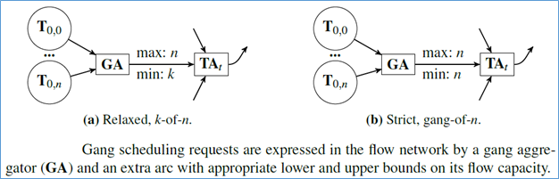

# Enablement of Gang Scheduling in Poseidon-Firmament Scheduler

- [Gang scheduling what is it?](#gang-scheduling-what-is-it)
- [Approaches](#approaches)
    - [Using Min-Capacity as part of Flow Graph](#using-min-capacity-as-part-of-flow-graph)
    - [Process each Gang Scheduling Job separately one-job-at-a-time](#process-each-gang-scheduling-job-separately-one-job-at-a-time)
    - [Process each Gang Scheduling Job separately one-job-at-a-time](#process-each-gang-scheduling-job-separately-one-job-at-a-time)

# Gang scheduling what is it?

Gang scheduling pertains to workload scheduling of jobs which cannot make progress unless all (or some) of their tasks are schedulable (for example, a synchronized iterative graph computation). Gang scheduling can be of two types:
Strict Gang scheduling is all-n (all or nothing) scheduling, some jobs cannot make progress unless all their tasks are schedulable.
Relaxed Gang scheduling is k-of-n scheduling, some jobs can begin processing even as tasks are scheduled incrementally.

Gang scheduling is an instance of complex placement constraints because several tasks have mutual dependencies: they all must be placed or none.

As compared to queue based schedulers, as Firmament already does workload/pod scheduling in bulk, it is much easier to enable this Gang Scheduling capability as part of Poseidon/Firmament scheduling. The following sections describe various approaches along with the pros and cons of each respective approach for enabling Gang Scheduling capability as part of Poseidon/Firmament scheduling.

# Approaches

## Using Min-Capacity as part of Flow Graph

This approach discusses gang scheduling in the context of min-cost flow schedulers. Min-cost flow-optimization schedulers cannot trivially express gang-scheduling constraints because they require dependent costs: the cost of a feasible assignment is infinite if even one of the other tasks in the gang remains unscheduled. However, the flow network can implement gang scheduling by using arc capacities to force a group of tasks to schedule.

This approach supports both relaxed gang scheduling policies, e.g. one that requires at least k out of n tasks to be placed, and a strict one which requires all tasks in a gang to schedule. Diagram below shows how this is works, both for relaxed, k-of-n gang scheduling and strict, all-n gang scheduling:

This approach proposes leveraging minimum flow arc requirements to force tasks to schedule. According to this approach, the scheduler adds per-job gang aggregator nodes to which it connects tasks it gang schedule. Following, the scheduler connects each gang aggregator node to a corresponding new per-job aggregator node (i.e. a task equivalence class aggregator). The scheduler sets a minimum flow requirement on the arc connecting each job’s two aggregator nodes equal to the number of job tasks it must gang schedule. Finally, the scheduler adds arcs from job aggregator nodes to preferred resource nodes. Following are the various steps for this approach:
A new gang aggregator vertex (GA) is added and all tasks in the gang are connected to it.
The gang aggregator is connected to a single aggregator that connects to the prior destinations of the tasks’ outgoing arcs. These destinations are typically aggregators themselves (i.e. a task equivalence class aggregator).
The lower bound on the capacity of the arc connecting the gang aggregator and the downstream aggregator is set to k (relaxed) or n (strict), and the upper bound to n.

Since the lower bound forces the new arc to have a flow of at least k, it constrains the acceptable solutions to the minimum-cost, maximum-flow problem. Namely, only solutions in which at least k tasks are scheduled are possible. If k = n, this enforces strict gang-scheduling of all n tasks.

This approach definitely seems to be much cleaner as it leverages flow graph constructs to enable gang scheduling. However, this approach has a limitation: all tasks are placed no matter how costly it is, and how many tasks (potentially higher-priority tasks) must be preempted. This limitation exists because the minimum flow requirements constraints must be satisfied for the output flow to be optimal and feasible.

Another major problem is the fact that not all min-cost-max-flow solvers provide support for setting minimum flow requirement. As a matter of fact, the open source CS2 & Lemon solvers we are currently using do not support this feature.

## Rearrange the Scheduling Round Delta after the fact

This approach uses standard flow graph using min-cost-max-flow solver like CS2. Gang scheduling is enabled after the scheduling delta is received back from the solver. In case of any gang scheduling requirements violations, Firmament scheduler rolls back all the “to be scheduled” tasks of a gang scheduling job.

Currently, we have already implemented this particular approach in order to enable gang scheduling capability within Poseidon/Firmament scheduler.

One fundamental problem with this particular approach is due to inefficient resource utilizations for non-gang scheduling jobs. Non-gang scheduling jobs are unnecessarily penalized in this case. Also, there may be some overall throughput degradation due to the “after the fact” scheduling delta processing.

## Process each Gang Scheduling Job separately one-job-at-a-time

This approach again uses standard flow graph using min-cost-max-flow solver like CS2. However, all the non-gang scheduling related jobs are processed separately from the gang scheduling jobs in order for efficient resource utilizations. Poseidon achieves this by invoking Firmament scheduler using multiple rounds. This way, non-gang scheduling jobs are not unnecessarily penalized.

Also, gang scheduling jobs are processed one job at a time in order for efficient resource utilizations.

Ordering of gang scheduling job runs and non-gang scheduling jobs run is configurable depending on the end user requirements.

We currently are exploring the possibility of using this particular approach in order to enable gang scheduling capability within Poseidon/Firmament scheduler.

One problem with this particular approach is due to the fact that as non-gang scheduling related jobs and gang scheduling related jobs are scheduled separately, this may adversely affect the overall throughput. Also, as gang scheduling and non-gang scheduling jobs are processed separately, overall resource utilization may not be optimal.
