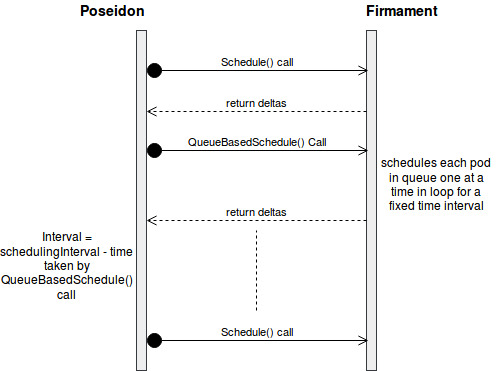
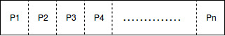
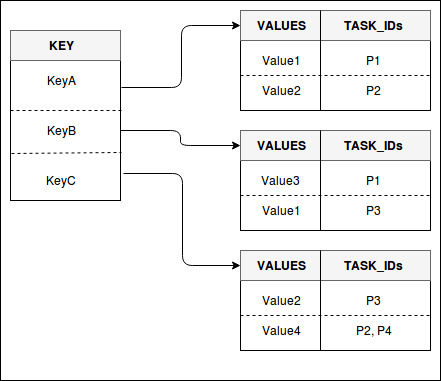

# Pod Affinity/Anti-Affinity Design for Firmament/Poseidon Scheduler

- [Motivation](#motivation)
    - [Goals](#goals)
    - [User Stories](#user-stories)
        - [Story 1](#story-1)

- [Proposed Design](#proposed-design)
    - [Firmament Design Details](#firmament-design-details)
        - [CPU-Memory Cost Model Enhancements](#cpu-memory-cost-model-enhancements)
        - [Key Processing Design Details](#key-processing-design-details)
            - [Revised Scheduling Round Processing](#revised-scheduling-round-processing)
            - [In-Memory Queue Details](#in-memory-queue-details)
            - [In-Memory Pod Label Entries Multi-level Hash-Map Details](#in-memory-pod-label-entries-multi-level-hash-map-details)
            - [Two types of Pod Affinity/Anti-Affinity Constraints](#two-types-of-pod-affinity-anti-affinity-constraints)
                -[Expressing Hard Constraints](#expressing-hard-constraints)
                -[Expressing Soft Constraints](#expressing-soft-constraints)
    - [Poseidon Design Details](#key-processing-design-details)

# Motivation

Firmament CPU/Memory multi-dimensional cost model (scheduling policy) typically does a reasonable placement (e.g. spread your pods across nodes, not place the pod on a node with insufficient free resources, etc.) but there are some circumstances where one may want more control over scheduling of a Pod/Workload that depends on where rest of the application (made up of Pods) is running. Typically, Pod affinity and pod anti-affinity allows you to specify rules about how pods should be placed relative to other pods.

Purpose of this design document is to enable such pod level affinity/anti-affinity functionality within Poseidon/Firmament scheduling environment.

## Goals

Kubernetes implements pod affinity/anti-affinity using “podAffinity” and “podAntiAffinity” fields as part of the “PodSpec”. Goal is to leverage these K8S pod definitions in order to enable pod level affinity/anti-affinity functionality within Firmament scheduler. Pod affinity/anti-affinity allows you to constrain which nodes your pod is eligible to be scheduled on based on the labels (a key/value pair) on other pods.

## User Stories

### Story 1

I/O-intensive workload such as log crawling might have a soft constraint for machines with a flash storage. In this example, a complex combinatorial constraint might indicate that only one task using the flash device may run on the machine at a time.
Or a Pod affinity scenario whereby two or more dependent tasks are placed on a machine (e.g., a task that runs a web server and a task that runs a database used by the web server).

By contrast, Pod anti-affinity constraints are used to model requirements for placing tasks on distinct resources. For example, some jobs may require tasks to be placed on different machines or racks for decreasing the likelihood of downtime in case of hardware failures.

# Proposed Design

## Firmament Design Details

Complex constraints typically involve inter-Pod dependencies. In Firmament the flow network’s arc costs cannot be dependent on each other. Tasks cannot have complex constraints: cluster workloads that have mutual dependencies between tasks - two popular types of such constraints are Pod affinity and Pod anti-affinity.

Pod affinity constraints create dependencies between two or more Pods for being placed on the same resource (e.g., a web server task must share a machine with a database task). By contrast, Pod anti-affinity constraints restrict Pods to only be placed on different resources (e.g., distribute database tasks across machines to improve fault tolerance).

Kubernetes default scheduler provides support for such complex constraints in which a pod can be placed or not placed on a node depending on which other pods are or are not running on that node. Such constraints are supported by Kubernetes because it places pods one by one. It initially places the first pod on a node, and following, the Kubernetes scheduler just has to place or avoid placing pods on this machine.

Currently, there are no ways to specify such constraints in min-cost flow-based schedulers (such as Firmament Scheduler). In order to enable inter-Pod dependencies, there is a need for Firmament to “drip-feed” Pods into the flow network one at a time in support of any Pod level affinity/anti-affinity requirements. So to facilitate inter-pod affinity/anti-affinity, we process the pods having pod affinity/anti-affinity in a separate scheduling round one at a time in a loop. This design document explains how we achieve the queue based scheduling for pods having pod affinity/anti-affinity in an optimized way.

### CPU-Memory Cost Model Overview

As a quick brief overview, Firmament scheduler models scheduling problem as a constraint-based optimization over a flow network graph. A min-cost flow algorithm is leveraged for deriving the implied workload placements. A flow network is a directed graph whose arcs carry flow from source nodes (i.e., pod nodes) to a sink node for a feasible solution to the optimization problem. A cost and capacity associated with each arc constrain the flow, and specify preferential routes for it.

In the CPU-Memory cost model, the task equivalence class (EC) gets created based on the task’s cpu and memory request. Each machine will have a set of predefined number of machine ECs (M0EC1, M0EC2,.., M2EC2) in order to do load distribution across filtered machines during each scheduling iteration.

It is important to highlight that if we have only one arc from task EC node to machine node, then there is a chance that all the incoming flows (tasks) flow across the single arc, and overloading the single machine with so many tasks even though there are machines with lot of available resources. So to avoid scheduling many tasks on a same machine, we use multiple arcs between task EC and machine nodes using intermediate machine EC nodes. We connect task EC to multiple machine ECs and then these machine ECs are connected to corresponding machine node. The capacity on the arc (task EC to machine EC) and arc (machine EC to machine node) is set to 1. And costs on arcs between task EC and machine ECs are assigned incrementally as shown in figure 1 below.

(Figure 1: CPU-Memory Cost Model Diagram)

Let us take an example where there are three machines M0, M1 & M2 and each machine has a capacity of 2 flows. Load distribution is achieved by assigning two arcs via corresponding machine ECs and the cost on each arc increases incrementally. In this case, arcs connecting to machine ECs for machine M0 have value of cost 100 and 200 respectively. Capacity on these arcs would be 1 each. In a nutshell, for each unit of capacity, there would be corresponding machine EC. The cost on these arcs would increase incremental in order to achieve load distribution across machines.

### Key Processing Design Details

As mentioned earlier that Pod affinity constraints create dependencies between two or more Pods for being placed on the same resource. By contrast, Pod anti-affinity constraints restrict Pods to only be placed on different resources. Such dependency of tasks (pods) is not supported by min-cost flow-based graph solvers. Firmament scheduler reconsiders all tasks in each scheduling round, but its current cost models do not generate flow networks that encode dependencies between tasks. Tasks’ flow supply is independently routed to the sink node.

There are various ways to work around this deficiency within Firmament. One of the design approaches we prescribe to is for Firmament to “drip-feed” Pods into the flow network one at a time (load admission and multi-round scheduling approach) in support of any Pod level affinity/anti-affinity requirements. This addresses all the inter-Pod dependencies issues.

With this approach, Pods having pod affinity/anti-affinity will be processed one at time within firmament in a loop for a fixed interval of time which is essentially an iterative queue based approach to process multiple pods in a single schedule round instead of waiting for the next scheduling round.

For every set of tasks with dependent affinity/anti-affinity constraints, we queue up all the incoming tasks into an in-memory queue. We also build out an in-memory multi-level hash-map to store labels of all the Pods deployed within Firmament. This allows us to optimally connect arcs and have paths to the machines on which other tasks with which they have affinity or anti-affinity constraints run.

In order to queue up incoming Pods with Pod level affinity/anti-affinity constraints, our design is making an assumption related to anti-affinity symmetry. In Kubernetes default scheduling, anti-affinity symmetry behavior is implicit. Our design, on the other hand, makes anti-affinity symmetry explicit for Pods. First of all, the symmetric property of pod anti-affinity has a huge impact on the overall performance. This is because for every incoming Pod (with Pod anti-affinity constraints or not), default scheduler scans all the deployed Pods in the cluster in order to ensure if there are any anti-affinity conflicts with the incoming Pod. In our design we remove the automatic anti-affinity symmetry behavior and make it explicit instead of implicit.

#### Revised Scheduling Round Processing

Typically, for each scheduling round within Poseidon, we issue a call out to Firmament “Schedule” function in order to schedule all the submitted tasks at a particular time. Poseidon is now enhanced to issue a Firmament “Schedule” call as before and additionally another “Queue Based Schedule” call as part of one scheduling round within Poseidon. Figure 2 below describes all this pictorially.

(Figure 2: Diagram showing scheduling round)

#### In-Memory Queue Details

A queue is maintained for pods having pod affinity/anti-affinity constraints. Any pod which has pod affinity/anti-affinity constraints gets added in this particular queue. Each pod in this queue is processed one at a time so that it can consider all running pods before taking a decision on which machine it can be placed on and satisfy all the pod affinity/anti-affinity constraints at the same time for those machines. If any pod remains unscheduled due to some reason then it is moved to the end of the queue and the next pod is allowed to be scheduled. Figure 3 below represents the queue structure.

(Figure 3: Pod Affinity/Anti-Affinity Queue)

#### In-Memory Pod Label Entries Multi-level Hash-Map Details

Figure 4 below shows the structural representation of multi-level hash-map for storing labels (<key, value> pair) of each pod and map it to the pod associated with the label. Let us take an example whereby Pods P1, P2, P3 and P4 have the following associated labels. The diagram illustrates below how the labels get mapped for each pod within the Hash-Map structure.
Pod P1: KeyA : Value1; KeyB : Value3
Pod P2: KeyA : Value2; KeyC : Value4
Pod P3: KeyB : Value1; KeyC : Value2
Pod P4: KeyC : Value4

(Figure 4: Labels Mapping for storing Key, Values and associated Task IDs)

#### Two types of Pod Affinity/Anti-Affinity Constraints

There are currently two types of pod affinity/anti-affinity definitions:
“requiredDuringSchedulingIgnoredDuringExecution” (i.e. Hard Pod Constraints)
“preferredDuringSchedulingIgnoredDuringExecution” (i.e. Soft Pod Constraints)
One can think of them as “hard” and “soft” respectively, in the sense that the former specifies rules that must be met for a pod to be scheduled onto a node, while the latter specifies preferences that the scheduler will try to enforce but will not guarantee.

##### Expressing Hard Constraints

For pod affinity/anti-affinity hard constraints, a submitted pod can only be placed on a machine if all the pods running in that machine meet all the hard constraint requirements present for that submitted pod.

As mentioned earlier that hard constraints for pod affinity/anti-affinity is expressed as “requiredDuringSchedulingIgnoredDuringExecution” within the pod spec. There can be combination of multiple hard constraints for a pod and all must be satisfied for any machine to be shortlisted by the pod.

“requiredDuringSchedulingIgnoredDuringExecution” is of type PodAffinityTerm which contains three things to consider: matchExpressions, namespaces and topologyKey.

There can be combination of multiple match expressions and each match expression can have operators such as “In”, “Not In”, “Exists” and “DoesNotExist”. Operators suggest how to compare key and values with the labels of already running pods on a machine.

Referring back to earlier Figure 4 labels map, following example illustrates how a match expression is verified with labels of already running pods on a machine.

Assume we have a pod submitted with pod affinity requirement match expression as                          “KeyA In Value2”. Here key is “KeyA”, operator is “In” and value is “Value2”. According to pod affinity rule the pod should be placed in a machine where any of the already running pod in that machine has a label with key as “KeyA” and value as “Value2”. So instead of scanning through all the running pods in that machine and also all the labels in each running pod we use the labels map to make things easier.

As labels map already has a mapping of key and value with the associated pods, we can directly search for the required <key, value> pair and get the list of associated pods. Subsequently, check for all the running pods in that list if any of those already running pods are running on the current machine then it means pod affinity is satisfied for that machine.

##### Expressing Soft Constraints

This section captures details for expressing pod affinity/anti-affinity soft constraints by altering the cost of arc between task EC to machine ECs and at the same time do the load distribution across relevant machines. The scheduler will prefer to schedule pods to nodes that satisfy the pod affinity/anti-affinity expressions specified by "preferredDuringSchedulingIgnoredDuringExecution" field, but it may choose a node that violates one or more of the expressions.
The node that is most preferred is the one with the greatest sum of weights, i.e. for each node that meets all of the scheduling requirements (resource request, requiredDuringSchedulingIgnoredDuringExecution affinity expressions, etc.), compute a sum by iterating through the elements of this field and adding "weight" to the sum if the running pods in a node satisfies the corresponding matchExpressions; the node(s) with the highest sum are the most preferred.
The weighted pod affinity term for preferredDuringSchedulingIgnoredDuringExecution consists of two fields i.e. weight and pod affinity term. An empty preferred scheduling term matches all objects with implicit weight 0. A null preferred scheduling term matches no objects.
Pod affinity term of this field consists same fields as that of “requiredDuringSchedulingIgnoredDuringExecution” field.
Weight associated with matching the corresponding pod affinity term ranges from 1 to 100.
After satisfying hard constraints we draw arcs from task EC to machine ECs. And then cost on these arcs are assigned based on the available resources on that machine and summed weights of preferred (soft) constraints satisfied by running pods of the machine as explained in above steps.

For example, let us say machines M0, M1, M2 satisfy hard constraints but they may be preferred differently by a task depending on the weight and expressions matching mentioned in preferredDuringSchedulingIgnoredDuringExecution field of pod affinity/anti-affinity. For each node that meets all of the scheduling requirements (resource request, requiredDuringSchedulingIgnoredDuringExecution affinity expressions, etc.), compute a sum by iterating through the elements of preferred constraint field and adding "weight" to the sum if running pods in a node satisfy the corresponding matchExpressions.

This sum of weight is used to decrease the cost of the already drawn arc so that less cost will be assigned and hence node which has more sum of weight is more preferred. So we can reduce the overall cost by this weight sum amount for simplicity. So higher the weight, lesser the cost and more is the chance of task getting scheduled on that machine. And we are adding some big positive number (1000) to keep cost of the arc positive, as some flow solver may expect positive cost.

## Poseidon Design Details

Firstly, Kubernetes affinity protobuf message structure from generated.proto is mapped to Firmament's task descriptor protobuf message structure.

The affinity data structure from kubernetes pod.spec is parsed to the Poseidon data structure by calling ParsePod function. The Poseidon data structure, in turn, is then converted to the affinity structure of task descriptor by calling the following functions:
“getFirmamentPodAffinityTerm()” and “getFirmamentWeightedPodAffinityTerm()” for Pod Affinity in Poseidon.
“getFirmamentPodAffinityTermforPodAntiAffinity()” and “getFirmamentWeightedPodAffinityTermforPodAntiAffinity()” for Pod AntiAffinity in Poseidon.
The task descriptor data is then sent to the firmament by calling function addTasktoJob function within Poseidon.

There are two scheduling calls for one scheduling round. “Schedule” call processes pods not having pod affinity/anti-affinity and a new “QueueBasedSchedule” call processes pods having pod affinity/anti-affinity constraints. Figure 2 earlier shows how the scheduling calls are done.
