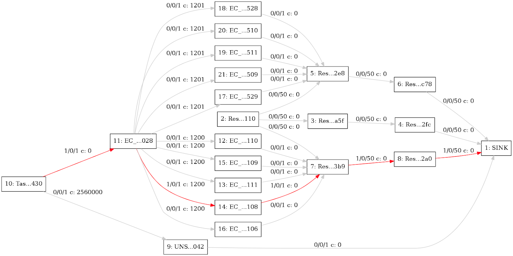

# Taints and Tolerations Design for Firmament/Poseidon Scheduler

- [Motivation](#motivation)
    - [Goals](#goals)
    - [User Stories](#user-stories)
        - [Story 1](#story-1)
        - [Story 2](#story-2)
        - [Story 3](#story-3)

- [Proposed Design](#proposed-design)
    - [Firmament Design Details](#firmament-design-details)
        - [CPU-Memory Cost Model Enhancements](#cpu-memory-cost-model-enhancements)
        - [Key Processing Design Details](#key-processing-design-details)
        - [Constraints for Taints/Tolerations](#constraints-for-taints-tolerations)
            - [Hard Constraint](#hard-constraint)
            - [Soft Constraint](#soft-constraint)
    - [Poseidon Design Details](#key-processing-design-details)

# Motivation
Firmament CPU/Memory multi-dimensional cost model (scheduling policy) typically does a reasonable placement (e.g. spread your pods across nodes, not place the pod on a node with insufficient free resources, etc.) but there are some circumstances where taints and tolerations allow the node to control which pods should (or should not) be scheduled on them.

This feature allows you to mark (“taint”) a node so that no pods can schedule onto it unless a pod explicitly “tolerates” the taint. Marking nodes instead of pods (as in node affinity/anti-affinity) is particularly useful for situations where most pods in the cluster should avoid scheduling onto the node.

Tolerations are applied to pods, and allow (but do not require) the pods to schedule onto nodes with matching taints.

Taints and tolerations work together to ensure that pods are not scheduled onto inappropriate nodes. One or more taints may be applied to a node, this marks that the node should not accept any pods that do not tolerate these taints.

Purpose of this design document is to enable such node taints and pod tolerations functionality within Poseidon/Firmament scheduling environment.

## Goals
Kubernetes checks if the pod is allowed to schedule onto the node. If the tolerations field in pod spec matches the taint on nodes , a pod with matching toleration would be able to schedule onto the node on which taint is applied.

## User Stories

### Story 1

Suppose node1 is applied taint using command kubectl taint nodes node1 key=value:NoSchedule. The taint has key “key”, value “value”, and taint effect “NoSchedule”. This means that no pod will be able to schedule onto node1 unless it has a matching toleration.
A toleration “matches” a taint if the keys are the same and the effects are the same, and:
the operator is Exists (in which case no value should be specified), or
the operator is Equal and the values are equal.
the operator defaults to Equal if not specified.

### Story 2

Suppose toleration field in a pod spec has an empty key with operator “Exists”, it means the pod will tolerate everything. The effect in the pod spec in this case be either of “NoSchedule” or “PreferNoSchedule” or “NoExecute”.

### Story 3

Suppose the toleration field in the pod spec has an empty effect , it means the pod matches all the effects with key “key”.

# Proposed Design

## Firmament Design Details

Kubernetes processes multiple taints and tolerations is like a filter i.e. start with all of a node’s taints, then ignore the ones for which the pod has a matching toleration; the remaining un-ignored taints have the indicated effects on the pod.

### CPU-Memory Cost Model Overview
As a quick brief overview, Firmament scheduler models scheduling problem as a constraint-based optimization over a flow network graph. A min-cost flow algorithm is leveraged for deriving the implied workload placements. A flow network is a directed graph whose arcs carry flow from source nodes (i.e., pod nodes) to a sink node for a feasible solution to the optimization problem. A cost and capacity associated with each arc constrain the flow, and specify preferential routes for it.

In the CPU-Memory cost model, the task equivalence class (EC) gets created based on the task’s cpu and memory request. Each machine will have a set of predefined  number of machine ECs (M0EC1, M0EC2,.., M2EC2) in order to do load distribution across filtered machines during each scheduling iteration.

It is important to highlight that if we have only one arc from task EC node to machine node, then there is a chance that all the incoming flows (tasks) flow across the single arc, and overloading the single machine with so many tasks even though there are machines with lot of available resources. So to avoid scheduling many tasks on a same machine, we use multiple arcs between task EC and machine nodes using intermediate machine EC nodes. We connect task EC to multiple machine ECs and then these machine ECs are connected to corresponding machine node. The capacity on the arc (task EC to machine EC) and arc (machine EC to machine node) is set to 1. And costs on arcs between task EC and machine ECs are assigned incrementally as shown in figure 1 below.

(Figure 1: CPU-Memory Cost Model Diagram)

Let us take an example where there are three machines M0, M1 & M2 and each machine has a capacity of 2 flows. Load distribution is achieved by assigning two arcs via corresponding machine ECs and the cost on each arc increases incrementally. In this case, arcs connecting to machine ECs for machine M0 have value of cost 100 and 200 respectively. Capacity on these arcs would be 1 each. In a nutshell, for each unit of capacity, there would be corresponding machine EC. The cost on these arcs would increase incremental in order to achieve load distribution across machines.

### Key Processing Design Details

Taints are applied to a node through the node specification (NodeSpec) and apply tolerations to a pod through the pod specification (PodSpec). A taint on a node instructs the node to repel all pods that do not tolerate the taint.

Taints and tolerations consist of a key, value, and effect. An operator allows you to leave one of these parameters empty.

Toleration field can have three types of effects:
NoSchedule: If there is at least one un-ignored taint with effect “NoSchedule” then Kubernetes will not schedule the pod onto that node. But if there are already existing pods on the node before the taint with this effect is applied, then they continue to remain in the node.
PreferNoSchedule: If there is no un-ignored taint with effect NoSchedule but there is at least one un-ignored taint with effect “PreferNoSchedule” then Kubernetes will try to not schedule the pod onto the node.
NoExecute: If there is at least one un-ignored taint with effect “NoExecute” then the pod will be evicted from the node (if it is already running on the node), and will not be scheduled onto the node (if it is not yet running on the node).

If a taint with effect NoExecute is added to a node, then any pods that do not tolerate the taint will be evicted immediately, and any pods that do tolerate the taint will never be evicted. However, a toleration with NoExecute effect can specify an optional tolerationSeconds field that dictates how long the pod will stay bound to the node after the taint is added.

A toleration matches a taint:
If the operator parameter is set to Equal:
the key parameters are the same;
the value parameters are the same;
the effect parameters are the same.
If the operator parameter is set to Exists:
the key parameters are the same;
the effect parameters are the same.

There are the following default tolerations which the Kubernetes adds:
If the user pod configuration does not have a toleration for node.kubernetes.io/not-ready , kubernetes adds the toleration for node.kubernetes.io/not-ready with tolerationSeconds=300.
If the user pod configuration does not have a toleration for node.alpha.kubernetes.io/unreachable, kubernetes adds the toleration for node.alpha.kubernetes.io/unreachable with tolerationSeconds=300.
These automatically-added tolerations ensure that the default pod behavior of remaining bound for 5 minutes after one of these problems is detected is maintained.

### Constraints for Taints/Tolerations

#### Hard Constraint

If the effect of taint on nodes is “NoSchedule” or “NoExecute” and if the pod cannot tolerate these taints on the node, firmament should restrict the scheduling of pods onto this node.
A node with no taint should not be restricted for scheduling pods .

First, all the tolerations for a given pod spec is stored in a map with key as “toleration key + toleration effect” and value as “toleration value”. Then all the taints of an incoming node is matched to the key value pair of the map. The nodes for which key, value of all the taints is found in the map is said to be tolerant and arc is drawn from the task EC to machine EC.
However, arcs are not drawn from the task EC to machine EC, to prevent scheduling of the pods that are intolerant to the taints with effect NoSchedule/NoExecute of nodes.

#### Soft Constraint

Taints-tolerations priority only takes care about the taints and tolerations that have effect “PreferNoSchedule”.

If the effect of taint on node is “PreferNoSchedule” and is intolerable, the cost for the node should be more. So the cost for all the nodes is based on the number of intolerable taints on the node. Higher the count of intolerable taints of a pod with effect PreferNoSchedule, higher the cost.

First, all the tolerations for a given pod spec is stored in a map with key as “toleration key” with “PreferNoSchedule” effect and value as “toleration value”. Then all the taints with “PreferNoSchedule” effect of an incoming node is matched to the key value pair of the map. The nodes for which key, value of all the taints is found in the map is said to be tolerant and cost is not affected. But if any intolerable taints exist for a node, then the cost is incremented by the count of intolerable taints.

Suppose there are 5 taints with effect “PreferNoSchedule” for a given node, out of which only 3 taints are tolerable by a pod. So the cost of the node will be incremented by 2.

(Figure 2: CPU-Memory Cost Model Diagram with a node with 1 intolerable taint)

## Poseidon Design Details
Firstly, Kubernetes toleration and taint protobuf message structure from generated.proto is mapped to Firmament's task descriptor protobuf message structure and Firmament's resource descriptor protobuf message respectively.

The toleration data structure from kubernetes pod.spec is parsed to the Poseidon data structure by calling ParsePod function. The Poseidon data structure, in turn, is then converted to the toleration structure of task descriptor.
The task descriptor data is then sent to the firmament by calling function addTasktoJob function within Poseidon.

The taint data structure from kubernetes node.spec is parsed to the Poseidon data structure by calling ParseNode function. The Poseidon data structure, in turn, is then converted to the taint structure of resource descriptor.
The resource descriptor data is then sent to the firmament by calling function createResourceTopologyForNode function within Poseidon.
